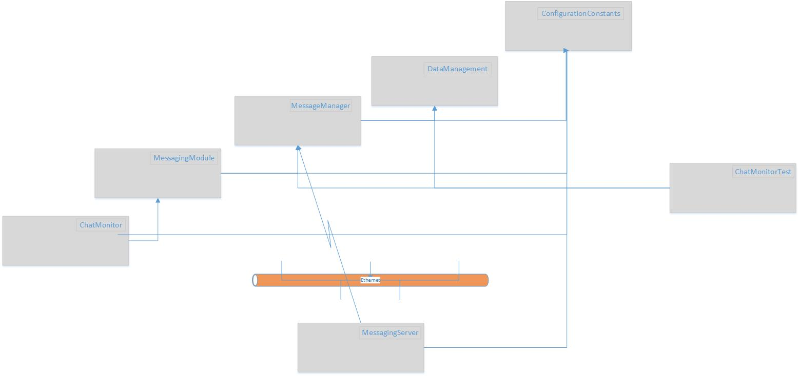

<h1 style="font-size:50px; color: crimson; text-align: center;">
  Bluberi Test Project
</h1>

This is a project for the Bluberi software engineering role. It pertains to WPF and service management using gRPC(Google).
The following is a high level architectural diagram of the solution:

<table>
	<tr>
		<td style="font-weight: bold;font-size: 50px;">
			<lable>Architecture</label>
		</td>
	</tr>
	<tr>
		<td>
			
		</td>
	</tr>
</table>

## Components

---
### ChatMonitor

The ChatMonitor is a WPF aplication. It was written using MVVM pattern from PRISM as well as the composite aplication pattern from PRISM.

***Note:** DI injection in the WPF uses the DI engine from PRISM. It was easier as there were things that were aligned more with PRISM DI.
 
---
### MessagingModule

The MessagingModule is a specialized component  that works with the composite application pattern. It provides explicit presentation aspects that the ChatMonitor will utilize. This is were messages are shown and message server connection is done. This is a means for decoupling the presentation components in a reusable plug and play fashion. This is where connection to the gRPC service is being done. Migration of messages is routed via event handling.

---
### MessageManager

The MessageManager is a specialized component that provided a generalized access point to the message service. It is designed to be distributable by any compnent that requires this access.

---
### DataManagement

The DataManagement provides specifics for the gRPC data defintions. It is maintained seperately for reuse and ability to keep the data model consistent between server and clients.

---
### ConfigurationConstants

The ConfigurationConstants component provides general properties of the solution. It gives consistant access to values that are used in different parts of the system.

---
### MessagingServer 
The MessagingServer component is a WEB Application that provides services for the messaging system. It utilized gRPC for service declaration. It is where clients will communicate and access information of the system remotely.

---
### ChatMonitorTest
The ChatMonitorTest provides testing of the messaging system. It can be used for validation of system state and identify progression to proceeding steps.
 
---
## Notes
- The design attempts to present a modular organization of the system. An attempt to keep the system flexible and maintainable by using concepts related to resuse and SOLID design principles. 

- I attempt to presnt a technique that I follow when developing software products. I want to have something in place that can be understandabl and handles by others easily. It is flexible and modular and componentised to easily grow without hindering the project to move forward.

- It was seen that if attempting to start access to server when it is not active then attempt access after started produced no results. Client would recieve no messages. Unfamiliarty of dRPC is probably related to not clearing serice connection completely. After reivew a correction was affected after understanding of proper channel shutdown and a conclusion that event processing had been deactivted.
